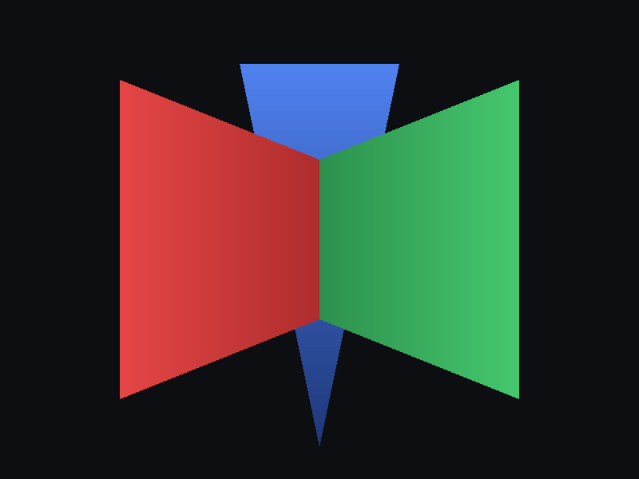

# softrast

CPU software rasterizer in C++. No GPU API, no graphics library, no dependencies —
edge-function triangle rasterization with barycentric interpolation, a z-buffer, and
per-stage counters for measuring where the work goes.



Three triangles that no draw order can render correctly. The blue blade passes in
front at the top and bottom of the frame and behind in the middle; the seam down the
centre is where the two wedges have equal depth. Nothing in the code sorts geometry or
computes a plane intersection — both fall out of one depth comparison per pixel.

## Build


cl /EHsc /O2 /std:c++17 main.cpp     # MSVC
g++ -O2 -std=c++17 -o raster main.cpp
```

Writes `out.bmp` and `depth.bmp`, and prints counters to stdout.

## Instrumentation

The point of the project is measurement, not pixels. Current numbers at 800x600:

| Metric | Value |
|---|---|
| Rasterizer efficiency (shaded / bbox tested) | 49.8% |
| Overdraw (shaded / pixels covered) | 1.43x |
| Shading discarded by depth test | 20.0% |
| Throughput | ~131 M fragments/sec, single-threaded |

Half of every bounding box tested is wasted work, and a fifth of all shading is
computed and then thrown away. Those two numbers are why real hardware rasterizes in
tiles and quads, and why early-Z and tile-based architectures exist.

## Validation

- **Coverage** cross-checked against the closed-form shoelace triangle area:
  0.017% agreement.
- **Draw-order independence** verified by FNV-1a hashing the framebuffer across three
  submission permutations of a scene with no valid depth ordering — all identical
  bit-for-bit.

## Build log

- [Day 1](docs/day1-log.md) — framebuffer, BMP writer, first triangle
- [Day 2](docs/day2-log.md) — z-buffer, depth interpolation, overdraw analysis
